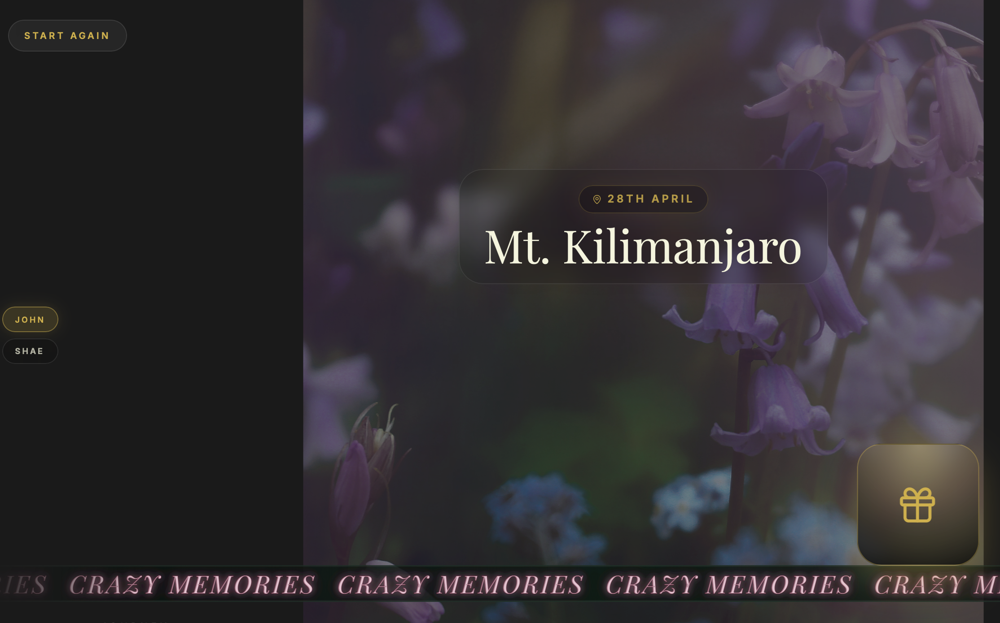

# omnipresent-pub
Omnipresent- A cinematic, scroll-driven memory capsule — built as a permanent URL you return to. Give someone a birthday, memorial, graduation, or any moment worth keeping.
### Sample →




## What it does

Horizontal scroll experience with per-slide backgrounds and ambient audio
Multiple "makers" (contributors) each with their own intro slide and scenes
Gift boxes on each scene — open to reveal photos, videos, audio messages, or handwritten letters
Parallax text, floating animations, GSAP-powered scroll
Entirely driven by a single scenes.json — no code changes needed per occasion


## Stack
React 19 · TypeScript · Vite · GSAP · Framer Motion · Tailwind CSS v4
Assets stores on free cloudflare bucket

## Getting started
npm install
npm run dev

## Customising for your occasion
1. Configure src/data/scenes.json
  The entire experience is defined in one file. Structure:
  json{
    "makers": [
   {
     "id": "maker-1",
     "title": "presents",
     "introLabel": "from sarah",
     "parallaxText": "rolling ticker text here...",
     "bg": "your-intro-bg.jpg",
     "ambientAudio": "audio/your-bg-music.mp3",
     "scenes": [
       {
         "parallaxText": "ticker text for this scene",
         "location": "big headline text",
         "day": "small label (date, place, occasion)",
         "bg": "scene-background.jpg",
         "gifts": [
           "images/photo.jpg",
           "videos/message.mp4",
           "audio/voice-note.m4a",
           "letters/letter.txt"
         ]
       }
     ]
   }
    ]
  }
  Each maker = one contributor's section. Each scene = one slide. Add as many of each as you need.

  

2. Add your assets
  src/assets/
    bg/          ← background images (one per scene)
    media/
   images/    ← photos
   videos/    ← video messages
   audio/     ← voice notes, background music
   letters/   ← .txt or .md files for written messages
  Assets are resolved by filename — just reference the filename in scenes.json, no path needed.


3. Deploy

   ```
   npm install
   npm run build
   npm run dev
   
   Push to GitHub and deploy via Vercel (zero config, free tier works).
   ```

   

## Gift types
TypeExtensionsHow to addPhotojpg, png, webp, gif"images/photo.jpg"Videomp4, mov, webm"videos/message.mp4"Audiomp3, m4a, wav"audio/voice.m4a"Lettertxt, md"letters/note.txt"

## Occasions
Birthdays · Memorials · Graduations · Retirements · Anniversaries · Anything worth keeping.

** Built by Codex, Pankstr  ** 
